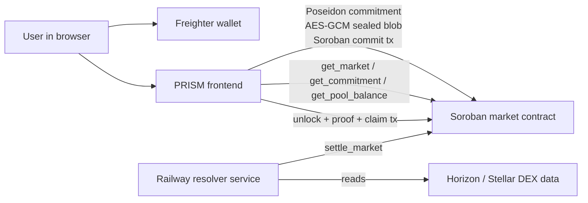
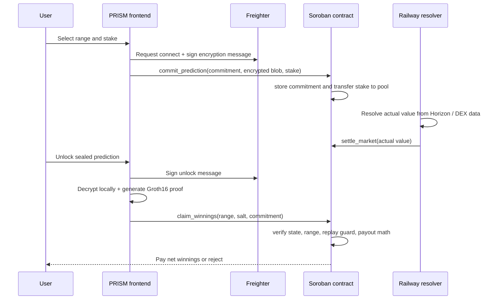

# PRISM

Private range prediction markets on Stellar.

Instead of betting yes or no, you predict a numeric range.
Tighter range = higher multiplier. Your prediction stays
sealed until settlement — then you prove it was right.

## Live Demo

**App:** [prism-amber-ten.vercel.app](https://prism-amber-ten.vercel.app/)

**Resolver:** [prism-production-9d69.up.railway.app/health](https://prism-production-9d69.up.railway.app/health)

**Contract:** `CAEZKGE2O6YYPSH366MYEAB62DSMYYUNKQTLXWEHEATJKAISAKRKLO2N`
[View on Stellar Expert →](https://stellar.expert/explorer/testnet/contract/CAEZKGE2O6YYPSH366MYEAB62DSMYYUNKQTLXWEHEATJKAISAKRKLO2N)

**Live markets:**
- Market 3003: Total XLM payments on Stellar testnet
- Market 3004: XLM/USDC price from Stellar mainnet DEX
- Market 3005: BTC price
- Market 3006: ETH price
- Market 3007: SOL price
- Market 3008: XLM price
- Market 3009: DOGE price
- Market 3010: HYPE price

## How It Works

1. Pick a market with a numeric outcome
2. Choose a range — your prediction is sealed as a
   Poseidon hash commitment on Stellar. Nobody sees
   your range.
3. Stake XLM — transferred to the contract pool on-chain
4. Market settles from live Stellar Horizon data
5. Unlock your sealed prediction, generate a Groth16 ZK
   proof locally, then submit a claim — the contract
   validates the range and pays out

## Why ZK Is Essential

Without ZK, range prediction markets break. The moment
you place a bet, everyone can see your range. Skilled
forecasters get copied instantly. The precision multiplier
— which rewards tighter ranges — becomes worthless because
anyone can wait and copy the tightest visible range.

With ZK, your range is sealed as a cryptographic
commitment before settlement. Copying is mathematically
impossible — you can see there's a commitment, but you
cannot see what range it represents. At claim time, you
generate a Groth16 proof locally that proves two things
without revealing them early: your commitment matches
your actual range, and the settled result falls inside it.

ZK is not a privacy feature added on top. It is the
reason the core mechanic works at all.

## Architecture





### Runtime Boundaries

| Layer | Responsibility |
|---|---|
| Frontend | Range entry, wallet connection, encryption, proof generation, claim UX, live polling |
| Freighter | Wallet authorization, transaction signing, encryption-message signing |
| Soroban contract | Market state, stake custody, settlement state, payout logic, nullifier checks |
| Railway resolver | Reads public Stellar data and posts settlement to the contract |
| Horizon / DEX | Source data for the two live Stellar Metrics markets |

## Why Stellar Specifically

**Stellar-native data:** PRISM's Stellar Metrics markets
settle from Horizon API data — total XLM payment volume
and the XLM/USDC price from the SDEX. An authenticated
resolver fetches this public data and posts the result to
the Soroban contract. Anyone can independently verify the
source value.

**BN254/Poseidon host functions:** Stellar Protocol 25
introduced native BN254 elliptic curve operations
(CAP-0074) and Poseidon/Poseidon2 hashing (CAP-0075)
as host functions. These are the exact primitives PRISM's
ZK stack uses. On-chain Groth16 verification is the
production upgrade path — the contract and circuit are
structured to support it.

**Low fees:** Soroban's near-zero transaction costs make
micro-predictions economically viable. A 5 XLM minimum
stake is practical because fees don't eat into returns.

**Freighter wallet:** Native Stellar wallet integration
for both transaction signing and deterministic encryption
key derivation.

## Data Flow

1. The UI reads market state from the Soroban contract.
2. The user selects a range and stake.
3. The frontend generates a Poseidon commitment in the browser.
4. The frontend encrypts the full prediction blob with a key derived from a Freighter signature.
5. The contract stores the commitment, encrypted blob, and stake.
6. The resolver posts the resolved value from public Stellar data.
7. The user unlocks the sealed prediction locally and generates a Groth16 proof in the browser.
8. The contract checks the stored commitment, range, settlement state, and duplicate-claim guard before paying out.

## What Is Real vs Simulated

| Component | Status |
|---|---|
| Circom range_market circuit | Real |
| snarkjs Groth16 proof generation in browser | Real |
| Local proof verification via snarkjs | Real |
| Poseidon commitment stored on Soroban | Real |
| AES-GCM prediction encryption via Freighter signature | Real |
| XLM stake transfer to contract | Real — testnet |
| Pool-based payout with 2% fee | Real — testnet |
| Duplicate claim prevention via nullifier | Real |
| Settlement rejection for missed ranges | Real |
| Horizon oracle for XLM payment volume | Real |
| Horizon/SDEX oracle for XLM/USDC price | Real |
| BN254 on-chain Groth16 proof verification | Not yet wired — see below |

## Current Limitation

The Soroban contract does not yet verify the Groth16
proof on-chain. The contract enforces commitment storage,
settlement state, range validation, payout math, and
duplicate prevention — but a modified client could
theoretically submit a different winning range.


The contract and circuit are structured to support BN254
on-chain verification via Stellar's CAP-0074 host
functions once a compatible verifier contract is
available. The verifier investigation is reproducible with
`scripts/verifier-smoke-test.ts`.

For this hackathon MVP: proof generation and local
verification are real, and Soroban enforces all
state transitions.

## Repo Map

- [`src/App.tsx`](./src/App.tsx) - routes, page composition, prediction flow, claim flow, and resolver polling.
- [`src/lib/commitment.ts`](./src/lib/commitment.ts) - Poseidon commitment generation.
- [`src/lib/crypto/prediction-encryption.ts`](./src/lib/crypto/prediction-encryption.ts) - Freighter signature-derived encryption.
- [`src/lib/contract/prism-market.ts`](./src/lib/contract/prism-market.ts) - generated contract client wrapper.
- [`contracts/prism_market/src/lib.rs`](./contracts/prism_market/src/lib.rs) - Soroban contract.
- [`server/resolvers.ts`](./server/resolvers.ts) - authenticated resolver logic.
- [`scripts/resolve-xlm-payments.ts`](./scripts/resolve-xlm-payments.ts) - CLI resolver entrypoint for XLM payments.
- [`scripts/resolve-xlm-usdc-price.ts`](./scripts/resolve-xlm-usdc-price.ts) - CLI resolver entrypoint for XLM/USDC.
- [`scripts/integration-test.ts`](./scripts/integration-test.ts) - live testnet scenarios.

## Payout Formula

```text
width = high - low

raw_multiplier = floor(max_range_width / width) - 1

multiplier = max(1, min(raw_multiplier, max_multiplier))

gross_payout = stake × multiplier

fee = gross_payout × 2%

net_payout = gross_payout - fee
```

Example: 10 XLM stake, range width 50, max width 1000
→ raw_multiplier = floor(1000 / 50) - 1 = 19
→ multiplier = max(1, min(19, 10)) = 10x
→ gross = 100 XLM, fee = 2 XLM, net = 98 XLM

Example: 10 XLM stake, range width 454, max width 1000
→ raw_multiplier = floor(1000 / 454) - 1 = 1
→ multiplier = 1x
→ gross = 10 XLM, fee = 0.2 XLM, net = 9.8 XLM

This formula applies to every market on the deployed
contract. Wide ranges can still win, but they no longer
earn a bonus multiplier. The multiplier only becomes
meaningful when the selected range is materially tighter
than the market's full allowed range.

Losing stakes remain in the contract pool and fund
future winning payouts.


## Architecture

```text
React frontend (Vite + TypeScript + shadcn)
├── Freighter wallet connection
├── Poseidon commitment generation (circomlibjs)
├── AES-GCM encryption (Freighter sig → HKDF → key)
├── Groth16 proof generation (snarkjs in browser)
└── Soroban contract calls

Soroban contract (Rust)
├── Market configuration and pool accounting
├── Commitment + encrypted blob storage
├── Settlement enforcement
├── Payout calculation and transfer
└── Nullifier-based duplicate prevention

Railway resolver service (Express + TypeScript)
├── Authenticated settlement endpoints
├── Horizon and SDEX metric collection
├── Stellar SDK transaction signing
└── Shared logic used by local resolver scripts

Circom circuit
└── circuits/range_market.circom
```

## Path to Mainnet

- Replace testnet XLM with USDC stakes
- Wire BN254 Groth16 verifier using CAP-0074 host functions
- Decentralized resolver network for trustless settlement
- Stellar anchor integration for fiat deposit/withdrawal
- Additional Stellar Metrics markets — SDEX volume,
  anchor TVL, corridor payment flows
- PRISM markets about Stellar's own metrics create a
  feedback loop: network growth makes markets more
  interesting and more liquid

## How to Run Locally

```bash
git clone [repo]
cd prismf
npm install
cp .env.example .env
# Fill in VITE_CONTRACT_ID and network config
npm run dev
```

To run the resolver:

```bash
npm run resolve:xlm-payments -- --max-pages=1
npm run resolve:xlm-usdc
```

The deployed resolver exposes:

```text
GET  /health
POST /resolve/xlm-payments
POST /resolve/xlm-usdc
POST /resolve/crypto-price
```

Settlement endpoints require `RESOLVER_ADMIN_TOKEN` as a
Bearer token. Resolver credentials remain server-side on
Railway and are never exposed to the frontend.

To run integration tests:

```bash
npx ts-node scripts/integration-test.ts
```

## ZK Circuit Details

**Proof system:** Circom + snarkjs + Groth16 (BN254)
**Commitment hash:** Poseidon(low, high, salt, market_id)
**Encryption:** AES-GCM with HKDF-derived key from Freighter signature

Private inputs: predicted_low, predicted_high, salt
Public inputs: commitment, actual_value, market_id, multiplier_tier

The circuit proves commitment correctness and range
containment without revealing the range.

## Deployed Contracts (Testnet)

| Contract | Address |
|---|---|
| PRISM Market v4 | `CAEZKGE2O6YYPSH366MYEAB62DSMYYUNKQTLXWEHEATJKAISAKRKLO2N` |
| Contract liquidity | 8,000 XLM funded |
| Markets | 3003-3010 created |
| Crypto market resolution time | June 29, 2026 00:00 UTC |
| Treasury/Resolver | `GDYC2AUKPBCFS24PIUYXUWPYL46QIQCELNUPTXA6B4SNNNTQJM2BBVP7` |

## Built With

- Circom + snarkjs (ZK proof generation)
- Soroban / Stellar SDK (smart contracts)
- React + Vite + TypeScript (frontend)
- shadcn/ui (components)
- Freighter (wallet)
- Stellar Horizon API (oracle)
- Express + Railway (resolver service)
